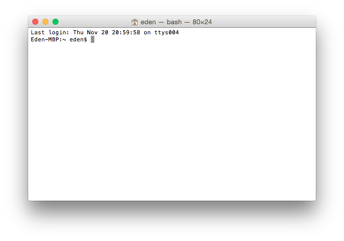

Silence Sounds
==============
**Guelph’s portal for adventurous new sound events.**

This is the source of the Silence website. It's written in [Jekyll](http://jekyllrb.com/), which means that content in written in Markdown. If you'd like to make a change please submit a pull request (see [Fork a Repo](https://help.github.com/articles/fork-a-repo/) for more information).
GitHub works well for our purposes because it allows the entire site to be open source, and it allows anyone to request a change. It also saves complete revision history for every change that is made.

The site will be live at [silencesounds.ca](http://silencesounds.ca) once we set this up and move all the content over.

* * *

To see what the site looks like, you’ll need to compile the code yourself, but don’t worry, it’s not hard. First of all, you should be on Mac OS X or Linux (it’s possible on Windows as well, but I don’t know the details). Download the entire repository (you can clone it, or you can [download it as a zip](https://github.com/EdenSG/Silence-Sounds/archive/master.zip))
You’ll need a couple things installed on your computer before you start:
* [Ruby](https://www.ruby-lang.org/en/downloads/) (your computer might have this already, you can test by running `irb` in a Terminal window)
* [RubyGems](https://rubygems.org/pages/download) (same as above, you can test by running `gem`)
* [NodeJS](http://nodejs.org/)

Once you have these, you can open a Terminal window. On OS X it looks something like this:

Type in `gem install jekyll` and hit enter. If you get a bunch of errors, it might mean you need to run the command with more privileges, like so: `sudo gem install jekyll`. Once that finishes, navigate to the Silence-Sounds folder (type `cd` and then drag the folder into the terminal window). Once you’re there it should say `NAME-OF-THE-FOLDER $` or something similar. Then, type in `jekyll serve`. It will tell you `Server address: ` and then something; copy the something (for me it’s `http://0.0.0.0:4000/`) into a browser address bar, and the website should be running! Then, when you make changes to the code, just reload the page to see the changes.
